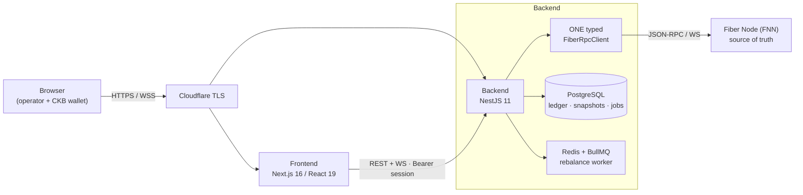
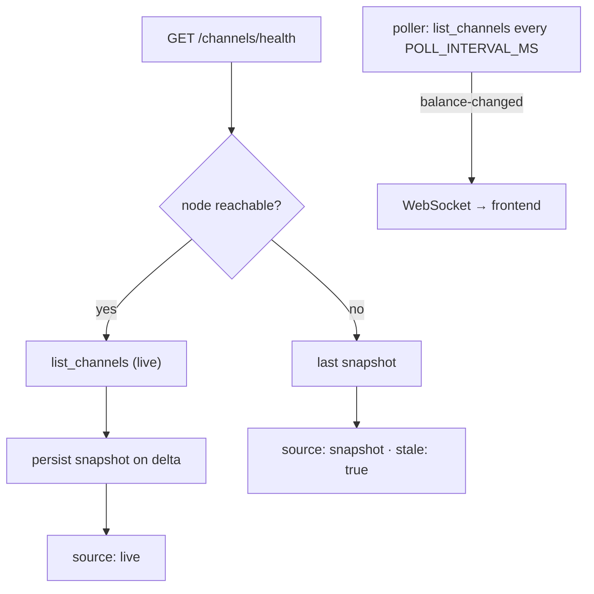
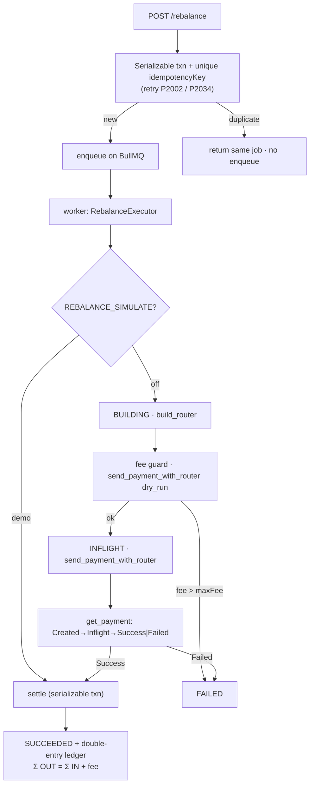
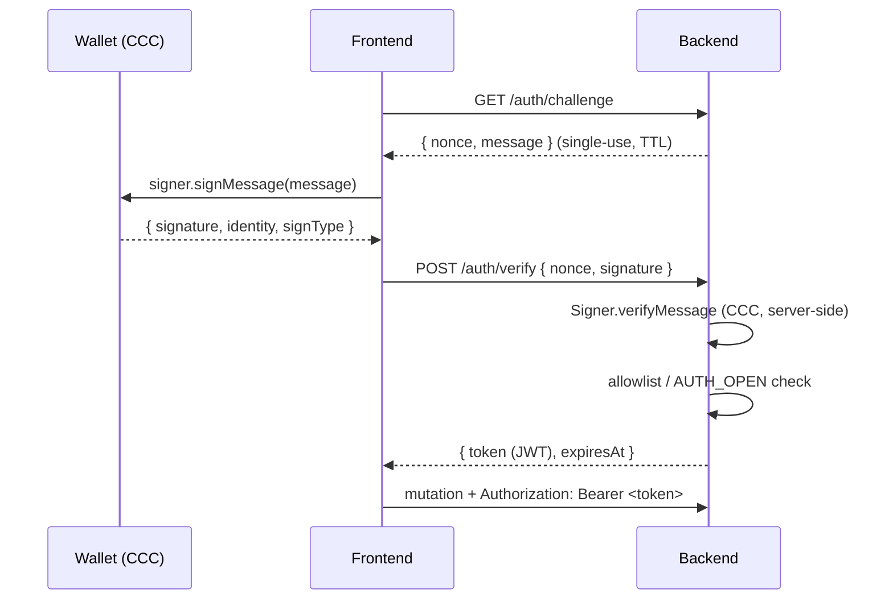
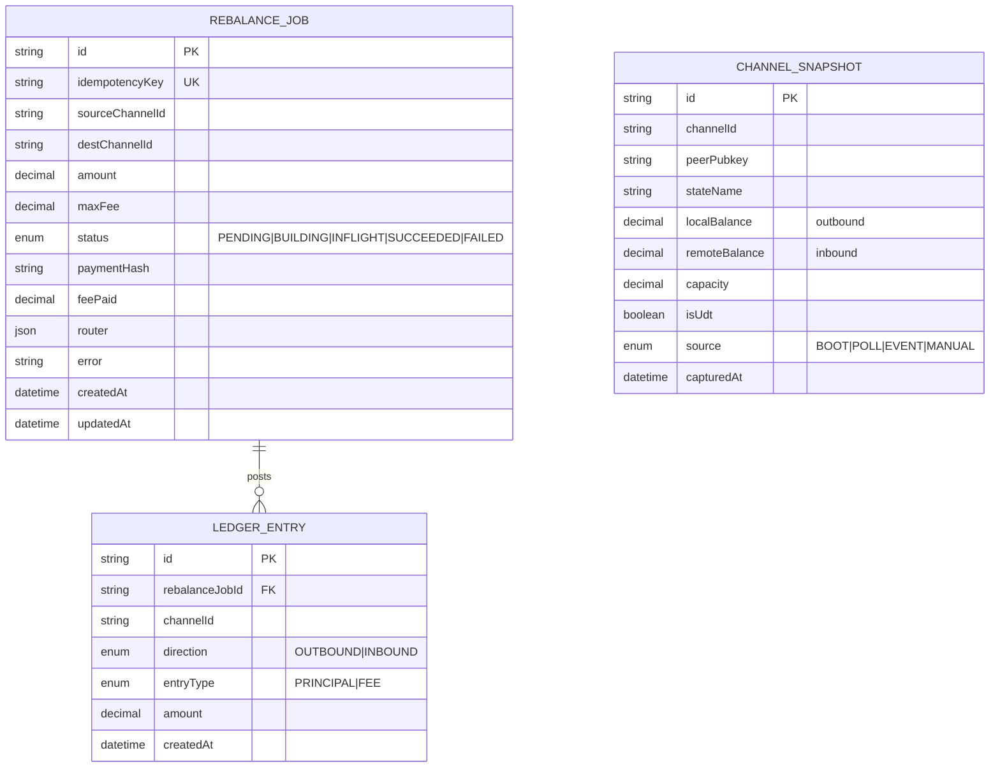

# Fiber Liquidity Layer

**An operability console for a CKB Fiber Network node.** It makes channel liquidity visible in real time, pre-flights payments with a `dry_run` **“can I pay?”** probe, and **self-heals** channel balance through idempotent circular rebalancing — all behind **Sign-In-With-CKB** operator identity, with every money-moving action recorded in a **balanced double-entry ledger**.

> _Making liquidity visible. Making payments predictable._

| | |
|---|---|
| **Live app** | https://sluice.drreamer.digital |
| **API** | https://api.sluice.drreamer.digital |
| **API docs (Swagger)** | https://api.sluice.drreamer.digital/docs |
| **Node** | Fiber Network Node (FNN) `0.9.0-rc7`, CKB **testnet** |

---

## 1. Business case

A raw Fiber node is **headless**. An operator running one has no way to:

- **see** their channel liquidity (how much they can send / receive per channel),
- **know** whether a payment will route **before** attempting it (and burning a failure),
- **rebalance** an over-funded channel into a depleted one **safely** (idempotent, no double-spend),
- keep an **audit trail** of what the tooling did.

The result is failed payments from depleted outbound, stranded liquidity, and zero observability — exactly the friction that keeps people from running routing nodes and Liquidity Service Providers (LSPs).

**Fiber Liquidity Layer is the operations/observability layer** that fixes this:

- **Visibility** — live per-channel outbound/inbound, aggregate health, reconciliation drift.
- **Payment reliability** — a dry-run probe answers *“can I pay X to Y?”* with fee, route, and bottleneck **before** funds move.
- **Self-healing** — circular rebalancing moves liquidity from over-funded to depleted channels, idempotently and concurrency-safely.
- **Trust** — the node is always the source of truth; a double-entry ledger audits every action.

**Audience:** Fiber node & routing operators, LSP / infrastructure teams managing channel liquidity, and developers who want a safe reference for operating an FNN node.

---

## 2. Features

- 📊 **Live liquidity dashboard** — per-channel outbound/inbound, health, peers, node identity; live-first from the node with a snapshot fallback and drift reconciliation.
- 🧭 **“Can I pay?” probe** — a `dry_run` `send_payment` returning `payable`, `fee`, `hops`, and `bottleneck` before any funds move.
- ♻️ **Self-healing rebalance** — circular self-payment (out the over-funded channel, back in the depleted one); idempotent, concurrency-safe, audit-logged.
- 🔐 **Sign-In-With-CKB** — connect a CKB wallet (JoyID / MetaMask / … via CCC), sign a challenge, get a session; reads public, mutations gated.
- 🧾 **Double-entry ledger** — every settled rebalance posts balanced rows (`Σ OUTBOUND = Σ INBOUND + fee`).
- 🔎 **Reconciliation** — snapshot vs node drift, where the node always wins.

---

## 3. Architecture



Every call to the node goes through **one typed `FiberRpcClient`** (hard rule #1 — no gRPC, no Rust, no on-chain code). The backend is a modular monolith of bounded contexts (`node`, `channels`, `routing`, `rebalance`, `ledger`, `reconciliation`, `auth`, `realtime`).

### Data flow (reads)



The node is the source of truth; the DB snapshot is only a labelled `stale` fallback.

---

## 4. Rebalance pipeline



The request path is thin; the work runs off it on a BullMQ worker. `REBALANCE_SIMULATE=true` is an **off-by-default demo mode** that drives the real lifecycle + ledger write but skips the node call (no funds move).

---

## 5. Sign-In-With-CKB



The wallet proves **operator identity** only — it never signs node operations (those stay server-side RPC). Verification runs in Node via `@ckb-ccc/core` for any wallet type (incl. JoyID).

---

## 6. Database (ERD)

All amounts are CKB **u128** stored as `Decimal @db.Decimal(40,0)` — lossless, never a JS `number`.



- **`RebalanceJob` 1—* `LedgerEntry`** — a settled rebalance writes 3 rows (OUTBOUND/PRINCIPAL, OUTBOUND/FEE, INBOUND/PRINCIPAL).
- **`ChannelSnapshot`** is standalone — a per-poll record used only as a stale fallback / reconciliation input (never authoritative; `channelId` refers to on-node state, not a FK).

---

## 7. Tech stack & structure

| Layer | Tech |
|---|---|
| Backend | NestJS 11 · Prisma 7 (`@prisma/adapter-pg`) · PostgreSQL · Redis + BullMQ · `@nestjs/jwt` · Zod · `@ckb-ccc/core` |
| Frontend | Next.js 16 · React 19 · Tailwind v4 · TanStack Query · `@ckb-ccc/connector-react` · framer-motion / GSAP |
| Node | `nervos/fiber` FNN `0.9.0-rc7` (JSON-RPC/WS via a socat sidecar) |
| Infra | pnpm monorepo · Docker · Dokploy on a VPS · Cloudflare |

```
.
├── backend/     NestJS API — bounded contexts under src/modules/*
│   └── src/
│       ├── modules/{node,channels,routing,rebalance,ledger,reconciliation,auth,realtime}
│       ├── infrastructure/{fiber-rpc,prisma}
│       ├── common/{guards,pipes,interceptors,filters,decorators}
│       └── config/
├── frontend/    Next.js console — canvas workspace + route pages
│   ├── app/{,network,channels,liquidity,probe,rebalance,reconciliation,alerts}
│   ├── components/{workspace,canvas-dashboard,layout,ui}
│   └── lib/{queries,liquidity,format,auth,api}
└── infra/       docker-compose for the FNN node + local deps
```

---

## 8. API reference

Base URL: `https://api.sluice.drreamer.digital` · interactive docs at **`/docs`** (OpenAPI JSON at `/docs-json`).

| Method | Path | Auth | Purpose |
|---|---|---|---|
| GET | `/health` | public | liveness |
| GET | `/node/info` · `/node/peers` · `/node/channels` · `/node/graph` | public | node identity, peers, graph |
| GET | `/channels/health` | public | live channel liquidity |
| GET | `/reconciliation/status` | public | snapshot vs node drift |
| GET | `/auth/challenge` | public | sign-in nonce |
| POST | `/auth/verify` | public | verify signature → session JWT |
| POST | `/routing/probe` | **operator** | “can I pay?” dry-run |
| POST | `/rebalance` | **operator** | queue a circular rebalance |
| GET | `/rebalance` | public | rebalance history |
| GET | `/rebalance/:id` | public | rebalance job status |
| GET | `/ledger/:rebalanceJobId` | public | double-entry ledger rows |

Every response uses the envelope `{ statusCode, message, data }`. Operator endpoints require `Authorization: Bearer <session>`.

---

## 9. Environment variables

**Backend** (`backend/.env`)

| Var | Purpose |
|---|---|
| `DATABASE_URL` | PostgreSQL (Prisma) |
| `REDIS_URL` | Redis for the BullMQ rebalance worker |
| `FIBER_RPC_URL` / `FIBER_WS_URL` | the single RPC seam to the node |
| `CORS_ORIGINS` | pinned frontend origin (`*` in dev) |
| `OPERATOR_KEYS` | allowlist of `<signType>:<identity>` operator wallets |
| `AUTH_JWT_SECRET` | HMAC secret for session JWTs (required with `OPERATOR_KEYS`/`AUTH_OPEN`) |
| `AUTH_OPEN` | `true` = any signed-in wallet may operate (demo); `false` = restrict to the allowlist |
| `DASHBOARD_SECRET` | break-glass `x-dashboard-secret` fallback for mutations |
| `REBALANCE_SIMULATE` | `true` = simulate a settled rebalance for demos (no node call, no funds) |
| `RUN_WORKER_INLINE` · `POLL_INTERVAL_MS` · `FIBER_RPC_TIMEOUT_MS` · `AUTH_SESSION_TTL_H` | worker / poller / timeouts |

**Frontend** (build args + runtime)

| Var | Purpose |
|---|---|
| `NEXT_PUBLIC_API_URL` / `NEXT_PUBLIC_WS_URL` | API location (build-time, inlined) |
| `NEXT_PUBLIC_CKB_NETWORK` | wallet network (default `testnet`) |
| `HOSTNAME=0.0.0.0` | standalone server bind (runtime) |

See `backend/.env.example` for the full annotated list.

---

## 10. Local setup

```bash
# 1) dependencies (Postgres + Redis) and the Fiber node
docker compose -f infra/docker-compose.deps.yml up -d
mkdir -p infra/fiber/data/ckb
node -e "console.log(require('crypto').randomBytes(32).toString('hex'))" | tr -d '\n' > infra/fiber/data/ckb/key
FIBER_SECRET_KEY_PASSWORD=dev-password docker compose -f infra/docker-compose.fiber.yml up -d   # RPC/WS on :8299

# 2) install + build (pnpm workspace)
pnpm install --frozen-lockfile
pnpm --filter backend build      # runs prisma generate + nest build

# 3) run
cp backend/.env.example backend/.env   # then set DATABASE_URL / REDIS_URL / FIBER_RPC_URL
pnpm --filter backend exec prisma migrate deploy
pnpm --filter backend start:dev        # http://localhost:3000  (Swagger at /docs)
pnpm --filter frontend dev             # http://localhost:3001
```

See [`infra/README.md`](infra/README.md) for funding the node + opening channels.

---

## 11. Deployment

All services run as containers on a VPS under **Dokploy**, joined on a private Docker network and reached by service name; **Cloudflare** terminates TLS.

- **Frontend** — Next.js standalone image; `NEXT_PUBLIC_*` are **build args**, `HOSTNAME=0.0.0.0` runtime.
- **Backend** — root `Dockerfile`; runs `prisma migrate deploy` then `node backend/dist/main.js`. All config is runtime env.
- **Node** — `nervos/fiber` + socat sidecar; reachable in-cluster as `fiber:8299`. Never exposed publicly.

---

## 12. Edge cases & guarantees

The five **hard rules** and the concrete cases the money path handles:

| Concern | How it's handled |
|---|---|
| **One RPC seam** | All node comms JSON-RPC/WS through a single `FiberRpcClient` — no gRPC, Rust, or on-chain code. |
| **Node is source of truth** | Reads are live-first; a DB snapshot is only a labelled `stale` fallback; reconciliation re-snapshots *from* the node. |
| **Idempotent double-submit** | `@unique idempotencyKey` + `Serializable` txn + P2002/P2034 retry → the same rebalance executes **at most once**; a duplicate returns the same job and never re-enqueues. |
| **Never retry fund-moving RPC** | `send_payment` / `send_payment_with_router` use `retries = 0` unless `dry_run` (a retry after execution could double-spend). |
| **Transient network errors** | ECONNRESET/timeout retried **only** for idempotent calls (reads, dry-runs). |
| **Fee protection** | The router is dry-run first; if `quotedFee > maxFee` the job **fails before** any funds move. |
| **u128 amounts** | Parsed/stored as `BigInt` / `Decimal(40,0)` end-to-end — never `Number()` (they exceed `MAX_SAFE_INTEGER`). |
| **Balanced-or-rejected ledger** | The double-entry write is refused unless `Σ OUTBOUND = Σ INBOUND + fee`. |
| **Node down** | `/channels/health` serves the last snapshot marked `stale`; the app renders a "node unreachable" state instead of crashing. |
| **No inbound liquidity** | Surfaced as an operator alert; a rebalance to a depleted dest fails honestly with the node's `no path found`. |
| **Auth modes** | Allowlist (`OPERATOR_KEYS`) · open (`AUTH_OPEN`) · break-glass (`DASHBOARD_SECRET`) · dev allow-all when nothing is configured; nonces are single-use with a TTL and sessions expire. |
| **CORS** | Pinned to the frontend origin in production (not `*`). |

---

## 13. Testing & CI

```bash
pnpm --filter backend test     # 27 unit tests (u128, ledger double-entry, rebalance idempotency, simulate, auth, guard)
pnpm --filter frontend test    # 25 unit tests (BigInt-safe formatting, liquidity derivations, alerts)
pnpm --filter backend typecheck
pnpm --filter frontend lint
```

GitHub Actions (`.github/workflows/ci.yml`) gates every push/PR: install → backend typecheck + test + build → frontend lint + test + build.

---

## 14. Security model

- **Reads public, mutations gated.** Money-moving endpoints require an operator wallet session (JWT), verified server-side.
- **Node RPC is never exposed** to the internet — the backend reaches it over a private network / loopback.
- **Helmet** security headers; **CORS** pinned to the frontend origin.
- The session JWT secret lives only on the backend; the wallet identity allowlist gates who may operate.

---

## 15. Roadmap

- Automated / policy-driven rebalancing (threshold triggers, scheduling).
- Browser-wallet **node funding** flow (expose the node's CKB receiving address).
- Multi-asset (UDT) liquidity views + rebalancing; LSP inbound-liquidity marketplace.
- Multi-operator roles; Redis-backed sessions/nonces for horizontal scale.
- Production node exposure via biscuit-auth (replacing the dev socat proxy).

---

## License & attribution

Operability tooling for the **CKB Fiber Network**. This project only **runs** the third-party FNN node and speaks to it over JSON-RPC/WebSocket — **no Rust, CKB scripts, or on-chain code are authored here**.
